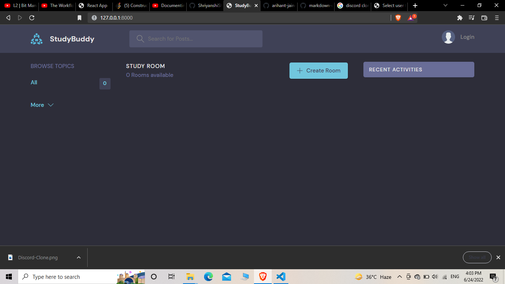

# Discord-clone
    

# Technologies
* Django
* HTML
* CSS
* DB SQLite

# Screenshot

# Table of contents
* About
* Installation
* Features
* Contribution

# About
A discord clone here users can create/join rooms regarding a certain topic and chat with each other.

* Django Web Development Framework is used.
* It is a MVT -Model View Template Framework.
* Base Language is Python for the framework.

# Installation
#install dependencies
$ python manage.py runserver
$ python manage.py makemigrations
$ python manage.py migrate
$ python manage.py createsuperuser

# Features
* Real time messaging
* Loads User Data upon login (Servers, Channels, Roles)
* Loading logo of Discord between page renderings
* Creation and Joining Servers
* Creation of Channels in a Server
* User Settings (Change name and delete)
* Channel Settings (Change name and delete)
* Reply to messages
* Timestamps for messages

# Contributions are always Welcome...

* Fork the repository
* Improve current program by
* improving functionality
* adding new feature
* bug fixes
* Push your work and Create a Pull Request